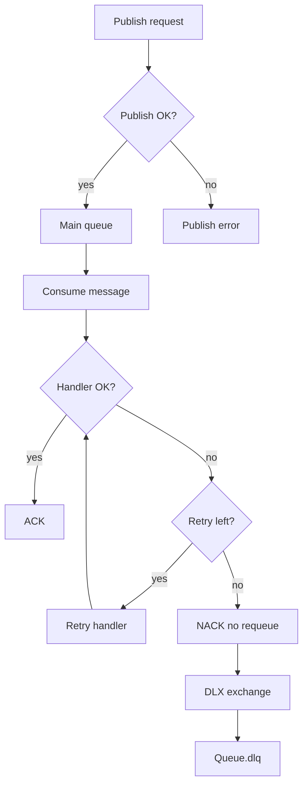

# Rmq.CloudEvents

[](https://github.com/tassosgomes/dotnet-rabbimq-lib/actions/workflows/ci.yml)
[](https://github.com/tassosgomes/dotnet-rabbimq-lib/actions/workflows/publish-nuget.yml)
[](https://www.nuget.org/packages/Rmq.CloudEvents)
[](https://www.nuget.org/packages/Rmq.CloudEvents)

.NET 8 library for RabbitMQ publishing/consuming with quorum queues, exponential retry, DLQ, and transparent CloudEvents wrapping.

[Leia em Portugues (pt-BR)](README.pt-BR.md)

## Features

- Quorum queue declaration with automatic DLQ (`<queue>.dlq`) and DLX wiring.
- Transparent CloudEvents structured JSON wrapping on publish and unwrapping on consume.
- Exponential retry with Polly for publish and consumer handler execution.
- DI-first registration for ASP.NET Core / Worker services.
- Consumer pipeline with automatic ACK on success and NACK (`requeue: false`) on final failure.

## Requirements

- .NET SDK 8.0+
- RabbitMQ 3.8+ (quorum queues)

## Install

If package is available on NuGet:

```bash
dotnet add package Rmq.CloudEvents
```

In this repository (local development), use project reference:

```xml
<ProjectReference Include="../../src/Rmq.CloudEvents/Rmq.CloudEvents.csproj" />
```

## Quick Start

### 1) Configure services

```csharp
using Rmq.CloudEvents.Configuration;
using Rmq.CloudEvents.Extensions;

builder.Services.AddRmqCloudEvents(options =>
{
    options.Connection = new RmqConnectionOptions
    {
        HostName = "localhost",
        Port = 5672,
        UserName = "guest",
        Password = "guest",
        VirtualHost = "/"
    };

    options.DefaultCloudEvents = new CloudEventsOptions
    {
        Source = new Uri("/my-service", UriKind.Relative),
        DefaultType = "com.mycompany.events"
    };
});
```

### 2) Register a consumer handler

```csharp
using Rmq.CloudEvents.Consuming;

builder.Services.AddRmqConsumer<OrderCreated, OrderCreatedHandler>("orders");

public sealed class OrderCreatedHandler : IRmqMessageHandler<OrderCreated>
{
    public Task HandleAsync(OrderCreated message, MessageContext context, CancellationToken cancellationToken)
    {
        Console.WriteLine($"Order {message.OrderId} received from {context.QueueName}, eventId={context.EventId}");
        return Task.CompletedTask;
    }
}

public sealed record OrderCreated(int OrderId, string CustomerId, decimal Total);
```

### 3) Publish messages

```csharp
using Rmq.CloudEvents.Publishing;

var publisher = serviceProvider.GetRequiredService<IRmqPublisher>();

await publisher.PublishAsync(
    queueName: "orders",
    payload: new OrderCreated(1, "cust-001", 99.90m),
    cloudEventType: "com.mycompany.order.created.v1",
    cancellationToken: cancellationToken);
```

With custom headers:

```csharp
await publisher.PublishAsync(
    queueName: "orders",
    payload: new OrderCreated(2, "cust-002", 149.50m),
    headers: new Dictionary<string, object>
    {
        ["x-correlation-id"] = "corr-123",
        ["x-tenant"] = "tenant-a"
    },
    cancellationToken: cancellationToken);
```

## Configuration Model

Main root object: `RmqOptions`

- `Connection` (`RmqConnectionOptions`)
  - `HostName`, `Port`, `UserName`, `Password`, `VirtualHost`, `Ssl`, `NetworkRecoveryInterval`
- `DefaultCloudEvents` (`CloudEventsOptions`)
  - `Source`, `DefaultType`, `SpecVersion`
- `DefaultRetry` (`RetryOptions`)
  - `MaxAttempts` (default `5`)
  - `InitialDelay` (default `1s`)
  - `BackoffType` (`Exponential`, `Linear`, `Constant`)
  - `UseJitter` (default `true`)
- `Queues` (`Dictionary<string, QueueOptions>`)
  - Per-queue overrides for quorum size, delivery limit, retry, and DLQ suffix.

## Runtime Behavior

- Publish:
  - Payload is wrapped as CloudEvent JSON (`application/cloudevents+json`).
  - Queue topology is declared (idempotent) before first publish.
  - Retry policy handles transient RabbitMQ/network errors.
- Consume:
  - Message is unwrapped from CloudEvent and your handler receives only the payload.
  - On success: ACK.
  - On final failure: NACK with `requeue: false`, message is routed to DLQ.

## Retry and DLX Flow

The flow below summarizes how publish retry, consumer retry, and DLX/DLQ routing behave together.



## Testing

- Unit tests:

```bash
dotnet test tests/Rmq.CloudEvents.Tests
```

- Integration tests (requires Docker):

```bash
dotnet test tests/Rmq.CloudEvents.IntegrationTests
```

## CI

GitHub Actions workflow is available at `.github/workflows/ci.yml` and runs:

- restore
- build (`Release`)
- unit tests with coverage
- integration tests
- pack (on `main`)

## Publish to NuGet

NuGet publishing is automated by `.github/workflows/publish-nuget.yml`.

1. Create a repository secret named `NUGET_API_KEY` with a valid nuget.org API key.
2. Release with a tag using semantic version prefixed by `v`:

```bash
git tag v1.0.1
git push origin v1.0.1
```

3. The workflow builds, tests, packs, and pushes `.nupkg`/`.snupkg` to nuget.org.

You can also run it manually from GitHub Actions (`workflow_dispatch`) and provide an optional `version` override.

## Sample App

See `samples/Rmq.CloudEvents.Sample/Program.cs` for an end-to-end DI + publish + consume example.

## License

MIT
