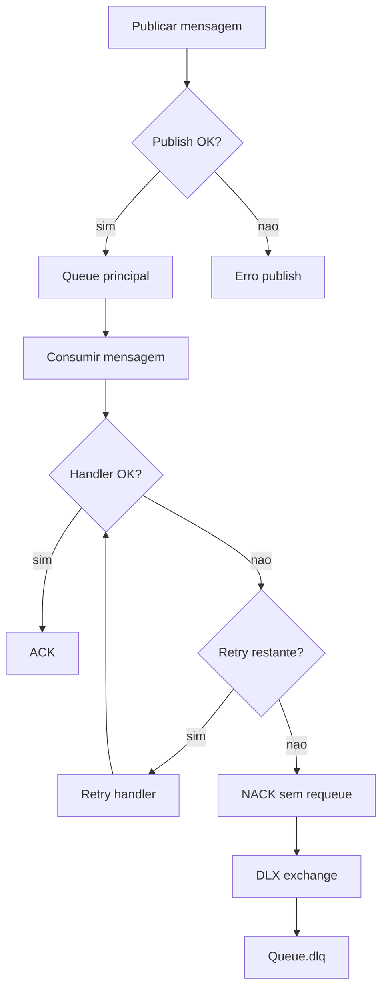

# Rmq.CloudEvents

[](https://github.com/tassosgomes/dotnet-rabbimq-lib/actions/workflows/ci.yml)
[](https://github.com/tassosgomes/dotnet-rabbimq-lib/actions/workflows/publish-nuget.yml)
[](https://www.nuget.org/packages/Rmq.CloudEvents)
[](https://www.nuget.org/packages/Rmq.CloudEvents)

Biblioteca .NET 8 para publicacao e consumo com RabbitMQ usando quorum queues, retry exponencial, DLQ e encapsulamento transparente em CloudEvents.

[Read in English](README.md)

## Funcionalidades

- Declaracao de quorum queue com DLQ automatica (`<queue>.dlq`) e DLX.
- Wrap/unwrap transparente de CloudEvents em JSON estruturado.
- Retry exponencial com Polly para publish e execucao do handler do consumer.
- Registro orientado a DI para ASP.NET Core / Worker Service.
- Pipeline de consumo com ACK automatico em sucesso e NACK (`requeue: false`) em falha final.

## Requisitos

- .NET SDK 8.0+
- RabbitMQ 3.8+ (quorum queues)

## Instalacao

Se o pacote estiver publicado no NuGet:

```bash
dotnet add package Rmq.CloudEvents
```

Neste repositorio (desenvolvimento local), use referencia de projeto:

```xml
<ProjectReference Include="../../src/Rmq.CloudEvents/Rmq.CloudEvents.csproj" />
```

## Guia Rapido

### 1) Configuracao dos servicos

```csharp
using Rmq.CloudEvents.Configuration;
using Rmq.CloudEvents.Extensions;

builder.Services.AddRmqCloudEvents(options =>
{
    options.Connection = new RmqConnectionOptions
    {
        HostName = "localhost",
        Port = 5672,
        UserName = "guest",
        Password = "guest",
        VirtualHost = "/"
    };

    options.DefaultCloudEvents = new CloudEventsOptions
    {
        Source = new Uri("/meu-servico", UriKind.Relative),
        DefaultType = "com.minhaempresa.eventos"
    };
});
```

### 2) Registro do consumer

```csharp
using Rmq.CloudEvents.Consuming;

builder.Services.AddRmqConsumer<OrderCreated, OrderCreatedHandler>("orders");

public sealed class OrderCreatedHandler : IRmqMessageHandler<OrderCreated>
{
    public Task HandleAsync(OrderCreated message, MessageContext context, CancellationToken cancellationToken)
    {
        Console.WriteLine($"Order {message.OrderId} recebida da queue {context.QueueName}, eventId={context.EventId}");
        return Task.CompletedTask;
    }
}

public sealed record OrderCreated(int OrderId, string CustomerId, decimal Total);
```

### 3) Publicacao de mensagens

```csharp
using Rmq.CloudEvents.Publishing;

var publisher = serviceProvider.GetRequiredService<IRmqPublisher>();

await publisher.PublishAsync(
    queueName: "orders",
    payload: new OrderCreated(1, "cust-001", 99.90m),
    cloudEventType: "com.minhaempresa.order.created.v1",
    cancellationToken: cancellationToken);
```

Com headers customizados:

```csharp
await publisher.PublishAsync(
    queueName: "orders",
    payload: new OrderCreated(2, "cust-002", 149.50m),
    headers: new Dictionary<string, object>
    {
        ["x-correlation-id"] = "corr-123",
        ["x-tenant"] = "tenant-a"
    },
    cancellationToken: cancellationToken);
```

## Modelo de Configuracao

Objeto raiz: `RmqOptions`

- `Connection` (`RmqConnectionOptions`)
  - `HostName`, `Port`, `UserName`, `Password`, `VirtualHost`, `Ssl`, `NetworkRecoveryInterval`
- `DefaultCloudEvents` (`CloudEventsOptions`)
  - `Source`, `DefaultType`, `SpecVersion`
- `DefaultRetry` (`RetryOptions`)
  - `MaxAttempts` (padrao `5`)
  - `InitialDelay` (padrao `1s`)
  - `BackoffType` (`Exponential`, `Linear`, `Constant`)
  - `UseJitter` (padrao `true`)
- `Queues` (`Dictionary<string, QueueOptions>`)
  - Override por queue para quorum size, delivery limit, retry e sufixo de DLQ.

## Comportamento em Runtime

- Publish:
  - Payload encapsulado em CloudEvent JSON (`application/cloudevents+json`).
  - Topologia da queue declarada antes do primeiro publish (idempotente).
  - Retry para falhas transientes de RabbitMQ/rede.
- Consume:
  - A mensagem e desencapsulada de CloudEvent e o handler recebe apenas o payload.
  - Sucesso: ACK.
  - Falha final: NACK com `requeue: false`, roteando para DLQ.

## Fluxo de Retry e DLX

O fluxo abaixo resume como o retry de publicacao, retry do consumer e roteamento para DLX/DLQ funcionam juntos.



## Testes

- Testes unitarios:

```bash
dotnet test tests/Rmq.CloudEvents.Tests
```

- Testes de integracao (requer Docker):

```bash
dotnet test tests/Rmq.CloudEvents.IntegrationTests
```

## CI

Pipeline em `.github/workflows/ci.yml` com:

- restore
- build (`Release`)
- testes unitarios com cobertura
- testes de integracao
- pack (apenas em `main`)

## Publicacao no NuGet

A publicacao no NuGet foi automatizada em `.github/workflows/publish-nuget.yml`.

1. Crie o secret do repositorio chamado `NUGET_API_KEY` com uma chave valida do nuget.org.
2. Gere uma release por tag semantica com prefixo `v`:

```bash
git tag v1.0.1
git push origin v1.0.1
```

3. O workflow executa build, testes, pack e publica `.nupkg`/`.snupkg` no nuget.org.

Tambem e possivel executar manualmente via GitHub Actions (`workflow_dispatch`) e informar um `version` opcional.

## Sample

Veja `samples/Rmq.CloudEvents.Sample/Program.cs` para um exemplo completo com DI + publish + consume.

## Licenca

MIT
